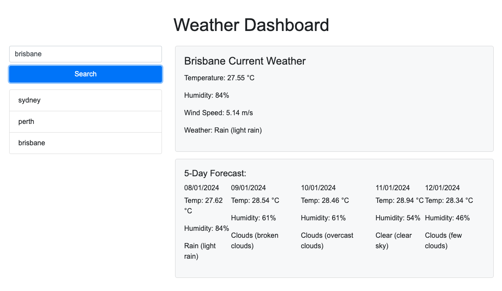

# module-6-weather-dashboard
A dashboard to look up the weather anywhere in the world

## Description

This project is designed to help users see the weather in cities around the world.

Users can search any city in the world and see the weather forecast for the next 5 days. It displays:
- Temperature
- Humidity
- Wind Speed
- Overall weather conditions

The search functionality saves previous searches so users can click back and see any city they previously searched. 

## Installation

This website can be access through any browser at the following URL: 
https://a-r3n.github.io/module-6-weather-dashboard/

## Usage

Users can enter their chosen city in the search bar at the top left of the screen. When they click 'Search' the weather forecast will display. 

One a user has searched for a city, the display will look like the following screenshot:

## Credits

The weather data has been provided by OpenWeatherMap (https://openweathermap.org/guide)

## License

The last section of a high-quality README file is the license. This lets other developers know what they can and cannot do with your project. If you need help choosing a license, refer to [https://choosealicense.com/](https://choosealicense.com/).

---

🏆 The previous sections are the bare minimum, and your project will ultimately determine the content of this document. You might also want to consider adding the following sections.

## Badges

Badges aren't necessary, but they demonstrate street cred. Badges let other developers know that you know what you're doing. Check out the badges hosted by [shields.io](https://shields.io/). You may not understand what they all represent now, but you will in time.

## Features

If your project has a lot of features, list them here.

## How to Contribute

If you created an application or package and would like other developers to contribute to it, you can include guidelines for how to do so. The [Contributor Covenant](https://www.contributor-covenant.org/) is an industry standard, but you can always write your own if you'd prefer.

## Tests

Go the extra mile and write tests for your application. Then provide examples on how to run them here.